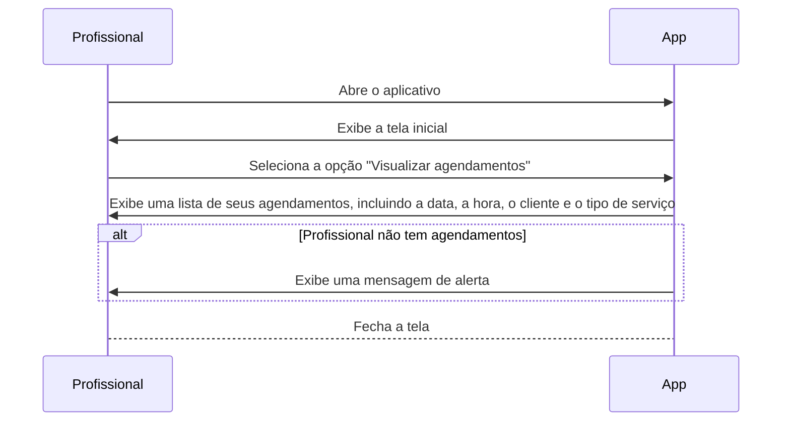
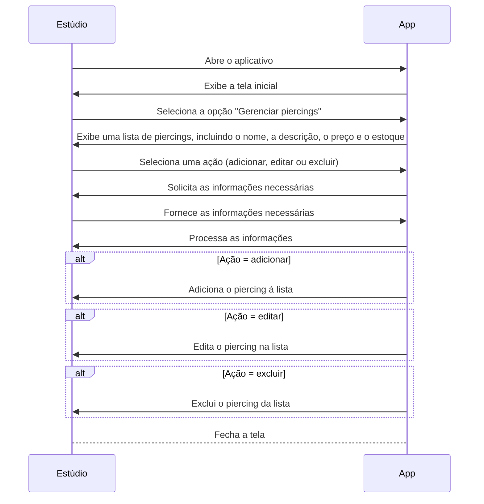
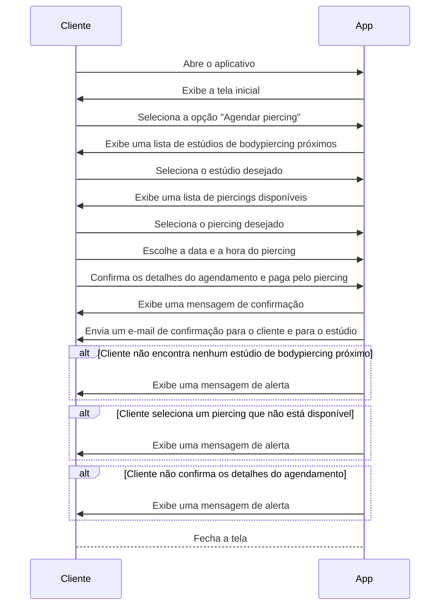

# AppPiercing

### Diagrama de classe de uso

####  "Visualizar agendamentos". O profissional abre o aplicativo, seleciona a opção "Visualizar agendamentos" e o aplicativo exibe uma lista de seus agendamentos. Se o profissional não tiver agendamentos, o aplicativo exibirá uma mensagem de alerta.

####   "Gerenciar piercings". O estúdio abre o aplicativo, seleciona a opção "Gerenciar piercings" e o aplicativo exibe uma lista de piercings. O estúdio então seleciona uma ação (adicionar, editar ou excluir) e fornece as informações necessárias ao aplicativo. O aplicativo processa as informações e, dependendo da ação, adiciona, edita ou exclui o piercing da lista.

#### Agendar piercing". O cliente abre o aplicativo, seleciona a opção "Agendar piercing" e o aplicativo exibe uma lista de estúdios de bodypiercing próximos. O cliente seleciona o estúdio desejado, o piercing desejado, a data e a hora do piercing e confirma os detalhes do agendamento. O aplicativo envia um e-mail de confirmação para o cliente e para o estúdio. Se o cliente não encontrar nenhum estúdio de bodypiercing próximo, o aplicativo exibirá uma mensagem de alerta. Se o cliente selecionar um piercing que não está disponível, o aplicativo exibirá uma mensagem de alerta. Se o cliente não confirmar os detalhes do agendamento, o aplicativo exibirá uma mensagem de alerta.

